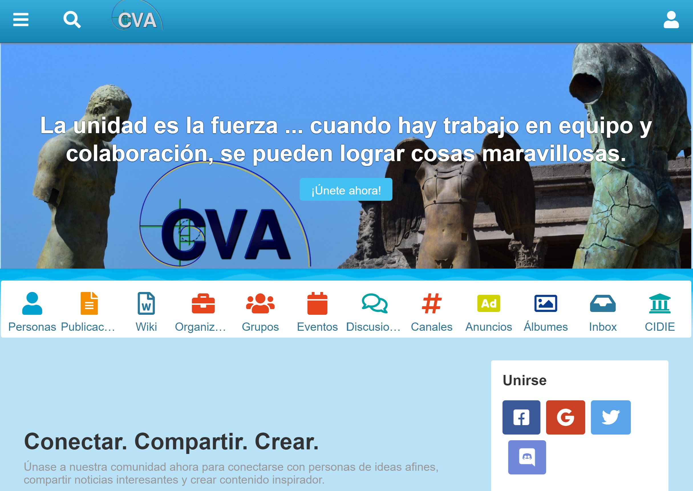
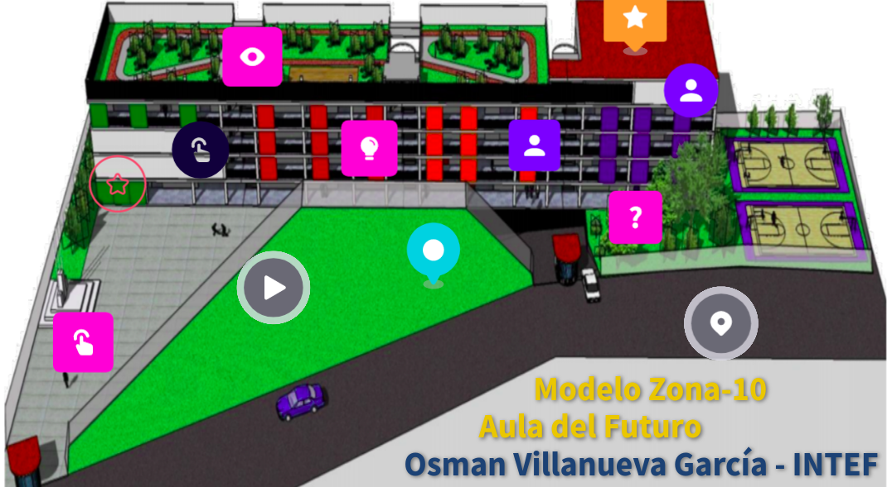

# CVA, Comunidad Virtual de Aprendizaje

===

La COMUNunidad de Aprendizaje VIRTUAL o también llamada "Comunidad Virtual de Aprendizaje" (CVA), ofrece una nueva forma de entender a la comunidad y el aprendizaje a partir del término Virtual y su sustento tecnológico. Translation: "Virtual Learning Community" offers a new way of understanding the community and learning from the Virtual term and its technological support. Un concepto desarrollado por el matemático mexicano Osman Villanueva García y el Centro Internacional en Docencia e Investigación Educativa, CIDIE.

A partir de acciones, la Comunidad Virtual de Aprendizaje (CVA - Comunavirtual.com) promueve que los recursos educativos tengan una licencia abierta y sean disponibles para facilitar la difusión al público de información confiable y práctica, siempre tanto en beneficio social como del desarrollo humano y sustentable - la Educación es para tod@s-.

## Comunidad Virtual de Aprendizaje (CVA)

    

        
    

 

La filosofía de la CVA se establece a partir de la premisa: "al Compartir saberes, Disfrutando, siempre se motiva el desarrollo de Aprendizajes". Las Ciencias de la Complejidad son el marco de referencia, ciencia interdisciplinar que rompe con las divisiones que tradicionalmente separan y delimitan las diversas áreas o disciplinas del conocimiento y, en donde, la CVA aspira a tender los puentes necesarios para que las ideas de disciplinas dispares, circulen de forma fluida en beneficio del desarrollo tanto de la disciplina específica como de la misma innovación científica; fundamental el estudio e investigación de sistemas complejos y sus propiedades, así como la participación activa de estudiantes, docentes, instituciones, organizaciones y sociedad en general. Para promoción de ésta filosofía del Proyecto CVA se invita a utilizar el HashTag: #ComparteDistrutaAprende 

## Captura de Pantalla - Modelo Zona 10, Aulas del Futuro

    

        
    

 

## CVA - HashTag - #comunavirtual
===

Frente a la pandemia COVID-19, la CVA - Comunavirtual.com une esfuerzos con estudiantes, maestros, expertos legales, empleados, profesionistas, científicos, empresarios y público en general para ofrecer, promover y sustentar acciones en beneficio de la educación para todos, de acceso abierto a la información y acorde con el compromiso denominado: “Open COVID Pledge”.

Website: https://comunavirtual.com/
